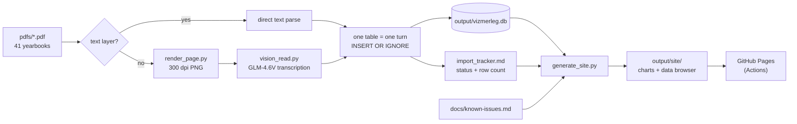

# Velencei-tó vízmérleg

Forty years of Lake Velence water-balance yearbooks (1986–2025), turned from PDF into a queryable
SQLite database — plus a small static site that charts it.

> **Magyarul:** a Közép-dunántúli Vízügyi Igazgatóság (KDT-VIZIG) évente megjelenő
> *Velencei-tó vízmérleg* kiadványainak táblázatai gépi úton feldolgozva, egyetlen SQLite
> adatbázisban. Az ábrák és a lefedettségi mátrix a publikált oldalon nézhetők meg.

**Live site:** https://lyahim.github.io/velencei-to-vizmerleg/ ·
**Original source:** [KDT-VIZIG — Velencei-tó vízmérleg kiadványok](https://www.kdtvizig.hu/kozep-dunantuli/vizgazdalkodas-vizszolgaltatas/csatolmanyok/velencei-to-vizmerleg/$rppid0x1187710x14_pageNumber/1)

---

## What this is

The lake's yearbooks are published as PDFs — the older ones as scans of typewritten and
hand-annotated tables. The numbers in them are the only continuous long-term record of the lake's
water budget: precipitation, inflow, evaporation, withdrawal, storage change. They are not
available anywhere as data.

This repository is the **data archaeology** that fixes that. The pipeline is not an app: it is a
set of documented rules, a per-table progress tracker, and a handful of flat Python scripts. The
**database (`output/vizmerleg.db`) is the product**; everything else exists to get numbers into it
correctly.

Extraction runs one table at a time, under strict rules — values are read once, never
re-derived, never back-computed from the balance equation, and anything ambiguous is stored as
`NULL` with a note rather than guessed. See [`EXTRACTION_GUIDE.md`](EXTRACTION_GUIDE.md) §0.

⚠️ **AI-assisted extraction.** Tables were transcribed by a large language model under human
supervision. Misread digits, shifted column labels and misunderstood units are possible, especially
in the older scanned yearbooks. Treat the DB as a faithful-but-unwarranted transcription; for
anything load-bearing, check the source PDF. Known defects are registered in
[`docs/known-issues.md`](docs/known-issues.md).

---

## The data

`output/vizmerleg.db` — SQLite, ~9 MB, 12 tables, 41 source documents (16 digital, 25 scanned).

| Table | Rows | Years | Contents |
|---|---:|---|---|
| `documents` | 41 | 1986–2025 | one row per source PDF; every data row references it |
| `stations` | 40 | — | gauge registry: water level, water temperature, discharge, precipitation |
| `station_metadata_history` | 45 | — | per-year station metadata (datum/nullpont etc.) |
| `monthly_balance` | 455 | 1991–2025 | the water balance itself — raw, adjusted and final columns; `month = 0` is the annual total |
| `monthly_station_obs` | 13 795 | 1990–2025 | monthly values per station/variable (`csapadek_mm`, `kozepes_m3s`, `leghomerseklet`, …) |
| `evaporation_inputs` | 432 | 1990–2025 | inputs of the evaporation calculation |
| `daily_obs` | 86 689 | 2002–2025 | daily water level, water temperature, discharge |
| `daily_station_extremes` | 11 | — | printed daily min/max per station-year |
| `expedition_flows` | 1 853 | 2010–2025 | individual inflow measurements on the tributaries |
| `annual_climate_summary` | 34 | 1991–2025 | figures stated in the yearbooks' narrative text |
| `historical_monthly` | 4 819 | 1929–1996 | long back-series reprinted in the 1996–2001 editions |
| `release_events` | 1 281 | 1990–2025 | reservoir releases and start-of-month water levels |

Column and variable names stay in the Hungarian forms the source uses (`csapadek_mm`,
`parologas`, `hozzafolyas`) — they are not translated. Full table→PDF mapping is in
[`EXTRACTION_GUIDE.md`](EXTRACTION_GUIDE.md) §5; station ids in §6.

### Querying it

```bash
# annual water balance, final accepted values (tómm)
sqlite3 output/vizmerleg.db \
  "SELECT year, csapadek, parologas, hozzafolyas, term_keszletv
     FROM monthly_balance WHERE month = 0 ORDER BY year;"

# daily water level at Agárd for one year
sqlite3 output/vizmerleg.db \
  "SELECT year, month, day, value FROM daily_obs
    WHERE station_id = 'agard_vizallas' AND year = 2022
    ORDER BY month, day;"
```

`output/vizmerleg_inserts.sql` is a **frozen historical snapshot** of an earlier state — it is not
kept in sync and should not be used as the data source.

---

## Coverage status

Progress is tracked per document *and per table* in [`import_tracker.md`](import_tracker.md).
Current tally of tracker rows:

| done | skip | pending | verify | error | tbd |
|---:|---:|---:|---:|---:|---:|
| 408 | 49 | 22 | 6 | 3 | 2 |

The yearbooks changed shape over time; the tracker and guide call these *eras*:

| era | years | shape |
|---|---|---|
| A | 1986–1995 | 8 core tables |
| B | 1996–2001 | adds the reprinted historical series (tbl10–16) |
| C | 2002–2010 | daily series embedded, no historical series |
| D | 2007–2024 | same as C, but text-layer PDFs |
| E | 2025– | tables renumbered; tbl1–9 are images with no text layer |

The site's *Forrás* page renders the same coverage as a year × table matrix.

---

## Repository layout

```
pdfs/                   41 source yearbooks, 1986–2025 (filenames match documents.filename verbatim)
output/vizmerleg.db     the product
scripts/                flat, single-job Python scripts (no package, no CLI framework)
site/                   static-site source: Hungarian templates + assets
docs/                   method write-ups, file index, known issues, chart plan
EXTRACTION_GUIDE.md     the operating manual for extraction
import_tracker.md       per-document, per-table progress
AGENTS.md / CLAUDE.md   agent instructions — routing table into the above
```

Per-file detail lives in [`docs/file-index.md`](docs/file-index.md).

---

## Pipeline



Scanned pages go through the vision route described in
[`docs/vision-extraction.md`](docs/vision-extraction.md).

---

## Building the site

```bash
pip install pandas numpy          # only deps of the generator
python3 scripts/generate_site.py  # reads DB + tracker + known-issues → output/site/
```

`output/site/` is generated and gitignored. It contains four Hungarian pages (`index`, `klima`,
`adattar`, `forras`), 12 pre-aggregated chart JSONs and 12 raw table JSONs. Bootstrap 5 and
Chart.js load from CDN — there is no build step.

Pushing a change to `output/vizmerleg.db`, `scripts/generate_site.py`, `site/**`,
`docs/known-issues.md` or `import_tracker.md` triggers
[`.github/workflows/pages.yml`](.github/workflows/pages.yml), which regenerates and deploys.

Chart selection and rationale: [`docs/climate-charts-plan.md`](docs/climate-charts-plan.md).

---

## Requirements

- `sqlite3`
- `pdftoppm` (poppler-utils) — only for rendering scanned pages
- Python 3.12 with `pandas` + `numpy` for `generate_site.py`

No build system, no package, no test suite. Changes are verified by running the script and
inspecting the real artifact — the written HTML, or a row count against the DB.

---

## Contributing

If you extract or correct data, read [`EXTRACTION_GUIDE.md`](EXTRACTION_GUIDE.md) §0 and §1 first.
Two rules matter more than the rest: **one table per change**, and **doubt means `NULL` plus a
tracker note** — never an interpolated, derived or back-computed value. Corrections that point at
a specific PDF page and printed value are the most useful kind.

---

## License

Code and compiled database: [MIT](LICENSE) © 2026 Mihaly Szlauko.
The underlying measurements are the work of KDT-VIZIG and are published in their yearbooks; cite
them as the origin of the numbers.
